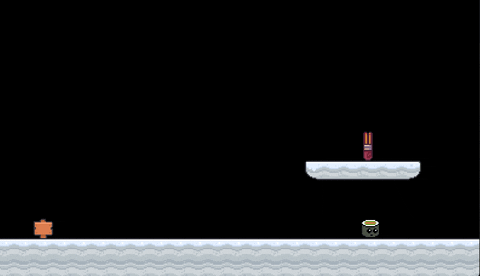

# Roomshift

Room-based camera with smooth transitions for LÖVE.



## Features

- Smooth camera panning between rooms
- Automatic viewport clamping to room boundaries
- Centers camera on rooms smaller than the viewport
- Configurable follow axes (horizontal, vertical, or both)
- Simple API with no dependencies beyond LÖVE

## Installation

Copy `roomshift.lua` into your project and require it:

```lua
local Roomshift = require("roomshift")
```

## Quick Start

```lua
local Roomshift = require("roomshift")

local camera
local player = { x = 100, y = 100, width = 16, height = 16 }
local room = Roomshift.newRoom(0, 0, 800, 480)

function love.load()
    camera = Roomshift.newCamera(400, 240, 480, "both")
end

function love.update(dt)
    camera:follow(player, room, dt)
    camera:update(dt)
end

function love.draw()
    camera:apply()
    -- Draw your world here
    love.graphics.rectangle("fill", player.x, player.y, player.width, player.height)
    camera:reset()
end
```

## API Reference

### Roomshift.newCamera(viewportWidth, viewportHeight, panSpeed, followAxes)

Creates a new camera instance.

| Parameter | Type | Description |
|-----------|------|-------------|
| `viewportWidth` | number | Width of the viewport in pixels |
| `viewportHeight` | number | Height of the viewport in pixels |
| `panSpeed` | number | Speed of room transitions in pixels per second |
| `followAxes` | string | `"horizontal"`, `"vertical"`, or `"both"` |

### Roomshift.newRoom(x, y, width, height)

Creates a room table. Helper function for convenience.

| Parameter | Type | Description |
|-----------|------|-------------|
| `x` | number | Left edge of the room in pixels |
| `y` | number | Top edge of the room in pixels |
| `width` | number | Width of the room in pixels |
| `height` | number | Height of the room in pixels |

Returns a table with `{ x, y, width, height }`.

### camera:follow(target, room, dt)

Follows a target within a room, respecting room boundaries. Call every frame.

| Parameter | Type | Description |
|-----------|------|-------------|
| `target` | table | Must have `x`, `y`, `width`, `height` properties |
| `room` | table | Must have `x`, `y`, `width`, `height` properties |
| `dt` | number | Delta time (unused, kept for API consistency) |

### camera:update(dt)

Updates camera position during room transitions. Call every frame.

### camera:apply()

Applies the camera transformation. Call before drawing world objects.

### camera:reset()

Resets the camera transformation. Call after drawing world objects.

### camera:getZoom()

Returns the current zoom level.

### camera:getClampedPosition(x, y, room)

Returns a position clamped to room boundaries. Useful for initial camera positioning.

### camera:clampToRoom(room)

Clamps the camera's current position to the given room boundaries.

### camera:startRoomTransition(newRoom)

Manually starts a smooth transition to a new room.

## Room Format

A room is any table with these properties:

```lua
{
    x = 0,        -- left edge in pixels
    y = 0,        -- top edge in pixels
    width = 800,  -- room width in pixels
    height = 480  -- room height in pixels
}
```

You can use `Roomshift.newRoom()` or create tables yourself. Rooms can come from Tiled, be hardcoded, or generated procedurally.

## License

MIT License. See [LICENSE](LICENSE) for details.
